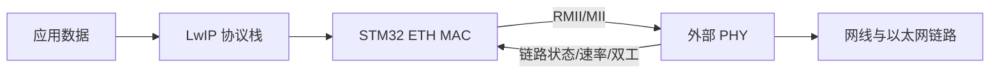

# MAC 层与 PHY 层

## 概念一句话精炼

MAC 负责组织和收发以太网帧，PHY 负责把数字接口转换为网线上的物理信号；二者通过 [[RMII 接口]] 或 MII 协作完成链路通信。

## 核心原理与图解



- MAC 侧处理帧缓存、目的地址、长度和 DMA 描述符。
- PHY 侧处理自动协商、物理编码、链路检测和 MII 管理寄存器。
- MAC 与 PHY 都正常，只能说明底层链路可用；TCP/IP 和应用回调仍需由 [[LwIP]] 配置。

## 关键实现与数据结构

```c
/* 伪代码：先复位 PHY，再初始化 MAC 和 DMA */
phy_reset_low();
phy_reset_high();
eth_config_rmii();                 // MAC 与 PHY 的接口模式一致
eth_dma_init(&rx_desc, &tx_desc);   // 描述符指向收发缓冲区
phy_link = phy_read_status();       // 读取链路、速率和双工状态
```

## 横向对比与关联

| 项目 | MAC | PHY |
|---|---|---|
| 主要职责 | 以太网帧和 DMA 收发 | 物理信号、链路协商 |
| 常见位置 | STM32 ETH 外设 | LAN8720、LAN8742、DP83848 |
| 关键排查点 | DMA、MAC 地址、缓存 | 复位、时钟、[[PHY 地址]] |

- [[STM32 ETH 外设]]：说明 MAC 在 STM32 中的集成方式。
- [[STM32 CubeMX 配置 LwIP]]：说明硬件配置如何进入协议栈。
- [[LwIP RAW API TCP 速查]]：说明上层如何使用 TCP。

## 来源

- raw 文件：`【LWIP】stm32用CubeMX配置LwIPplusPingplusTCPcl.md`
- raw 文件：`【LWIP】初学STM32plusLWIPplus网络遇到的基础问题记录-stm3.md`