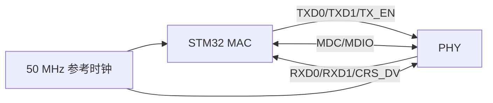

# RMII 接口

## 概念一句话精炼

RMII 是 MAC 与 PHY 之间的简化媒体独立接口，用较少信号线完成以太网数据、时钟和管理信号交换，并依赖 [[MAC 层与 PHY 层]]的职责分工。

## 核心原理与图解



- RMII 数据路径通常使用两位发送和两位接收数据线。
- 50 MHz 参考时钟必须由硬件方案明确提供，时钟方向要与 PHY 模式匹配。
- 原素材以 STM32F407 和 LAN8720 为例，并指出 LAN8720 只支持 RMII；具体能力仍需以芯片手册为准。

## 关键实现与配置

```c
/* 伪代码：接口模式、时钟和引脚必须与原理图一致 */
eth_select_mode(ETH_RMII_MODE);
configure_eth_pins();              // TXD、RXD、CRS_DV、MDC、MDIO
configure_50mhz_reference_clock();
phy_reset();
eth_start();
```

## 横向对比与关联

| 项目 | RMII | MII |
|---|---|---|
| 数据线 | 较少，常见为 2 位数据 | 较多，常见为 4 位数据 |
| 时钟 | 50 MHz 参考时钟 | 发送/接收时钟分离 |
| 适用侧重 | 节省 MCU 引脚 | 传统接口或既有硬件 |

若 ping 不通，不应只检查 RMII 模式，还应联查 [[PHY 地址]]、PHY 复位、参考时钟和 [[STM32 ETH 外设]]。

## 来源

- raw 文件：`【LWIP】stm32用CubeMX配置LwIPplusPingplusTCPcl.md`
- raw 文件：`【LWIP】初学STM32plusLWIPplus网络遇到的基础问题记录-stm3.md`