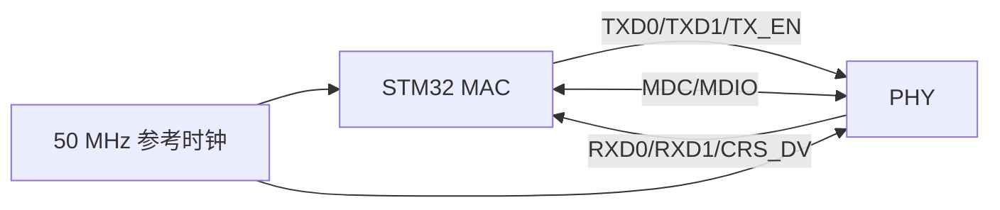

# RMII 接口

## 概念一句话精炼

RMII 是 MAC 与 PHY 之间的简化媒体独立接口，用较少信号线完成以太网数据、时钟和管理信号交换，并依赖 [[MAC 层与 PHY 层]]的职责分工。

## 核心原理与图解



> 图 1：RMII 用 TXD0/TXD1、RXD0/RXD1 和控制信号连接 MAC 与 PHY，50 MHz 参考时钟决定双方采样时序。

- RMII 数据路径通常使用两位发送和两位接收数据线。
- 50 MHz 参考时钟必须由硬件方案明确提供，时钟方向要与 PHY 模式匹配。
- 原素材以 STM32F407 和 LAN8720 为例，并指出 LAN8720 只支持 RMII；具体能力仍需以芯片手册为准。

## 硬件初始化与数据流

1. 确认 STM32 ETH MAC 和 PHY 都选择 RMII，检查 TXD0/TXD1、RXD0/RXD1、TX_EN、CRS_DV、MDC、MDIO 的引脚复用。
2. 确认 50 MHz 参考时钟来源：raw 记录的方案包括 LAN8720 由 25 MHz 晶振倍频输出，或由 MCU MCO 提供；具体时钟方向必须按板卡核实。
3. 完成 PHY 复位和时钟稳定，再配置 MAC 的 RMII 模式；复位保持时间及释放后的等待时间待核实。
4. 启动后，发送数据从 MAC 经 TXD/TX_EN 到 PHY，接收数据经 RXD/CRS_DV 回到 MAC；MDIO/MDC 只负责管理状态，不承载以太网帧。

### 接口状态说明

| 对象 | 地址/位域 | raw 可确认信息 | 影响 |
|---|---|---|---|
| RMII 模式选择 | MAC 配置字段，具体地址待核实 | raw 要求 MAC/PHY 统一选择 RMII | 模式不一致时数据线解释错误 |
| 50 MHz 参考时钟 | 外部时钟连接，非本页可确认寄存器 | raw 明确 RMII 必须有 50 MHz | 无稳定时钟时收发无法可靠采样 |
| CRS_DV | PHY→MAC 控制信号 | raw 将其列为 RMII 接线信号 | MAC 判断接收载波/数据有效 |
| MDC/MDIO | PHY 管理接口，地址待核实 | 用于读取 PHY ID 和链路状态 | 只影响管理访问，不替代数据通道 |
## 关键实现与配置

> 以下为流程伪代码；函数名只表达 RMII 初始化步骤，不代表 STM32 HAL 或 PHY 官方 API。

```c
/* 伪代码：接口模式、时钟和引脚必须与原理图一致 */
eth_select_mode(ETH_RMII_MODE);
configure_eth_pins();              // TXD、RXD、CRS_DV、MDC、MDIO
configure_50mhz_reference_clock();
phy_reset();
eth_start();
```

## 横向对比与关联

| 项目 | RMII | MII |
|---|---|---|
| 数据线 | 较少，常见为 2 位数据 | 较多，常见为 4 位数据 |
| 时钟 | 50 MHz 参考时钟 | 发送/接收时钟分离 |
| 适用侧重 | 节省 MCU 引脚 | 传统接口或既有硬件 |

若 ping 不通，不应只检查 RMII 模式，还应联查 [[PHY 地址]]、PHY 复位、参考时钟和 [[STM32 ETH 外设]]。

## 来源

- raw 文件：`【LWIP】stm32用CubeMX配置LwIPplusPingplusTCPcl.md`
- raw 文件：`【LWIP】初学STM32plusLWIPplus网络遇到的基础问题记录-stm3.md`