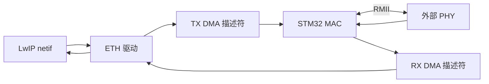

# STM32 ETH 外设

## 概念一句话精炼

STM32 ETH 是部分 STM32 芯片集成的以太网 MAC 外设，通常通过 DMA 与收发缓冲区交互，再经 [[RMII 接口]]连接外部 PHY。

## 核心原理与图解



> 图 1：LwIP 通过 ETH 驱动把 pbuf 交给 TX DMA；接收方向由 RX DMA 把 PHY/MAC 收到的帧交回协议栈。

- 带 ETH 的 MCU 通常只集成 MAC，仍需外接 LAN8720、LAN8742 或 DP83848 等 PHY。
- ETH 外设不能替代完整的 TCP/IP 协议栈；协议处理由 [[LwIP]] 等软件完成。
- 原素材以 STM32F407 为例，并以 STM32F103 作为不带 ETH 的对比例子；具体型号必须查数据手册。

## 硬件初始化、DMA 数据流与状态

1. 开启 ETH 外设时钟并配置 RMII/MII 引脚；STM32F407 是否具备 ETH、STM32F103 是否不具备 ETH，均需以具体型号数据手册为准。
2. 完成外部 PHY 供电/复位和参考时钟准备；raw 未给出统一复位电平、保持时间，标记为待核实。
3. 初始化 TX/RX DMA 描述符和缓冲区，再配置 MAC 与 PHY 的接口模式。
4. 通过 MDIO/MDC 读取 PHY ID 与链路状态；链路未建立时不应把问题误判为 LwIP TCP 配置错误。
5. 发送路径：LwIP pbuf → ETH 驱动 → TX 描述符 → MAC → RMII → PHY；接收路径：PHY → RMII → MAC → RX 描述符 → ETH 驱动 → LwIP netif。

### 描述符与寄存器状态边界

| 对象 | 地址/字段 | raw 可确认信息 | 需要观察的状态 |
|---|---|---|---|
| ETH 时钟/接口配置 | 具体寄存器地址待核实 | raw 确认需要选择 ETH 和 RMII/MII | 时钟开启、模式匹配 |
| TX/RX DMA 描述符 | 结构布局待核实 | raw 确认描述符指向收发缓冲区 | 缓冲区地址、长度、所有权状态 |
| MAC 收发状态 | 具体寄存器地址待核实 | raw 只确认 ETH 负责 MAC 数据包收发 | 收发是否启动、错误状态 |
| PHY 链路状态 | MDIO 寄存器地址待核实 | raw 确认读取 PHY 链路/速率/双工 | link up、速率和双工结果 |

netif_add 属于 LwIP 接口；eth_clock_enable、eth_dma_init 等名称是本页伪代码或工程封装，不是可直接当作 STM32 官方 API 的函数。
## 关键实现与配置

> 以下为流程伪代码；函数名只表达硬件步骤，不代表 STM32 HAL、ETH 驱动或 LwIP 官方 API。

```c
/* 伪代码：硬件收发链路的最小初始化顺序 */
eth_clock_enable();
eth_gpio_init();
phy_reset();
eth_dma_init(rx_desc, tx_desc);
netif_add(&netif, &ip, &mask, &gw, &ethif);
```

## 横向对比与关联

- **STM32 ETH + 外部 PHY**：MCU 提供 MAC，PHY 提供物理层。
- **W5500**：外部芯片集成 MAC/PHY，MCU 通常通过 SPI 访问。
- **只有 SPI 网卡**：硬件架构不同，不能直接套用 STM32 ETH 的引脚和 DMA 配置。

- [[MAC 层与 PHY 层]]
- [[PHY 地址]]
- [[STM32 CubeMX 配置 LwIP]]
- [[LwIP]]

## 来源

- raw 文件：`【LWIP】stm32用CubeMX配置LwIPplusPingplusTCPcl.md`
- raw 文件：`【LWIP】初学STM32plusLWIPplus网络遇到的基础问题记录-stm3.md`