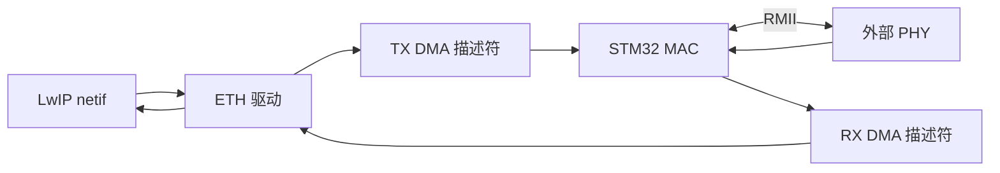

# STM32 ETH 外设

## 概念一句话精炼

STM32 ETH 是部分 STM32 芯片集成的以太网 MAC 外设，通常通过 DMA 与收发缓冲区交互，再经 [[RMII 接口]]连接外部 PHY。

## 核心原理与图解



- 带 ETH 的 MCU 通常只集成 MAC，仍需外接 LAN8720、LAN8742 或 DP83848 等 PHY。
- ETH 外设不能替代完整的 TCP/IP 协议栈；协议处理由 [[LwIP]] 等软件完成。
- 原素材以 STM32F407 为例，并以 STM32F103 作为不带 ETH 的对比例子；具体型号必须查数据手册。

## 关键实现与配置

```c
/* 伪代码：硬件收发链路的最小初始化顺序 */
eth_clock_enable();
eth_gpio_init();
phy_reset();
eth_dma_init(rx_desc, tx_desc);
netif_add(&netif, &ip, &mask, &gw, &ethif);
```

## 横向对比与关联

- **STM32 ETH + 外部 PHY**：MCU 提供 MAC，PHY 提供物理层。
- **W5500**：外部芯片集成 MAC/PHY，MCU 通常通过 SPI 访问。
- **只有 SPI 网卡**：硬件架构不同，不能直接套用 STM32 ETH 的引脚和 DMA 配置。

- [[MAC 层与 PHY 层]]
- [[PHY 地址]]
- [[STM32 CubeMX 配置 LwIP]]
- [[LwIP]]

## 来源

- raw 文件：`【LWIP】stm32用CubeMX配置LwIPplusPingplusTCPcl.md`
- raw 文件：`【LWIP】初学STM32plusLWIPplus网络遇到的基础问题记录-stm3.md`