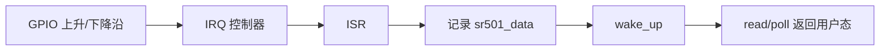

# Linux GPIO 中断

## 概念一句话精炼

Linux GPIO 中断把输入电平的边沿变化转换为内核事件，驱动通常在 ISR 中记录状态并唤醒 [[Linux 等待队列]]，再由用户态 `read` 或 `poll` 获取结果。

## 核心原理与图解



> 图 1：GPIO 边沿经 IRQ 控制器进入 ISR，ISR 只发布最小事件并唤醒进程上下文，最终由 read/poll 返回用户态。

ISR 应尽量短小：只做确认事件、保存最小状态和唤醒后续处理，不能执行可能睡眠的操作。原始代码使用上升沿和下降沿触发，实际触发方式需要根据 SR501 输出语义和硬件电平确认。

## 硬件到用户态流水线与并发

1. GPIO 边沿进入 IRQ 控制器后执行 ISR；ISR 只读取必要状态、更新共享事件并唤醒等待者。
2. 共享的 sr501_data 需要使用 READ_ONCE/WRITE_ONCE、原子变量或锁；若事件不能合并，应使用事件计数而不是固定值 1。
3. request_irq 的返回值必须检查；失败时 probe 要回滚已经申请的 GPIO、字符设备等资源。
4. copy_to_user、可能睡眠的 GPIO 读取和复杂日志只能放在进程或线程化中断上下文。

## 关键实现与数据结构

```c
static irqreturn_t sr501_isr(int irq, void *dev_id)
{
    struct sr501 *dev = dev_id;
    WRITE_ONCE(dev->data, 1);                 // 只记录事件，不在 ISR 中 copy_to_user
    wake_up_interruptible(&dev->wq);
    return IRQ_HANDLED;
}

ret = request_irq(irq, sr501_isr, IRQF_TRIGGER_RISING | IRQF_TRIGGER_FALLING,
                  "sr501", dev);
```

## 横向对比与关联

- **硬中断处理**：响应快，但上下文受限，不能直接访问用户空间。
- **线程化中断**：顶半部返回 `IRQ_WAKE_THREAD` 后，必须配套 threaded handler；原始代码未展示完整配对，属于待确认问题。
- **轮询**：实现简单但延迟和 CPU 占用更差。

资源释放顺序通常包括 `free_irq`、GPIO 释放和设备节点注销，需与 `probe` 的成功路径一一对应。

- [[Linux GPIO 输入]]
- [[Linux 字符设备驱动]]
- [[Linux SR501 驱动]]

## 来源

- raw 文件：`Linux驱动SR501代码.md`