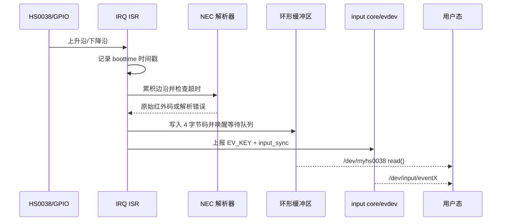

# Linux HS0038 红外驱动

## 概念一句话精炼

HS0038 驱动在 GPIO 双边沿中断中采集 NEC 红外脉宽，完成校验和扫描码生成，并同时通过字符设备与 [[Linux input 子系统]] 输出事件。

## 核心原理与图解



> 图 1：同一条红外接收链同时保留私有字符设备路径和标准 input/evdev 路径；二者消费的是同一次解析结果。

## 硬件到软件的驱动时序链

1. 设备树以 `compatible = "100ask,hs0038"` 匹配 `platform_driver`，进入 `probe()`。
2. 获取 GPIO 描述符并转换为 IRQ，配置上升沿和下降沿触发；正式实现应先完成 input 设备注册，再开启 IRQ，避免 ISR 访问未初始化的 `input_dev`。
3. ISR 使用 `ktime_get_boottime_ns()` 记录边沿时间。相邻边沿间隔超过 30 ms 时，丢弃当前帧并以本次边沿重新开始。
4. 累积至少 68 个边沿后，按每两次边沿间隔是否超过 1 ms 解码 32 位 NEC 数据；低位先到，每 8 位组成一个字节。
5. 校验地址字节与命令字节的反码关系，通过后生成 `(data[0] << 8) | data[2]` 原始码；4 边沿且时序满足约 8~10 ms、随后小于 3 ms 时视为重复码，复用上次 `hs0038_data`。
6. 成功码写入 8 槽环形缓冲区并唤醒等待队列，同时映射为 Linux `KEY_*` 后提交 input 事件。

## 关键实现与数据结构

```c
static irqreturn_t hs0038_isr(int irq, void *dev_id) {
    edge_time[edge_cnt++] = ktime_get_boottime_ns(); // 记录边沿
    if (edge_cnt >= 2 && edge_time[edge_cnt-1] - edge_time[edge_cnt-2] > 30000000) {
        edge_time[0] = edge_time[edge_cnt-1]; edge_cnt = 1; return IRQ_HANDLED;
    }
    if (hs0038_parse_data(&val) == 0) {
        put_data(val); wake_up(&hs0038_wq);         // 私有字符设备路径
        hs0038_report_key(hs0038_input_dev, val);   // 标准 input 路径
    }
    return IRQ_HANDLED;
}
```

环形缓冲区以 `r/w` 判断空满，容量为 8 时实际可存 7 个元素；满时当前实现静默丢弃新码。正式驱动应使用每设备私有结构体、锁或合适的并发原语保护 `r/w`、边沿计数和 input 指针，避免多个设备实例互相覆盖。

## 两条用户态接口

| 接口 | 内核路径 | 用户态语义 |
| :--- | :--- | :--- |
| `/dev/myhs0038` | `put_data -> wait_queue -> hs0038_drv_read -> copy_to_user` | 读取原始 4 字节红外码 |
| `/dev/input/eventX` | `input_event -> input_sync -> evdev_client` | 读取标准 `EV_KEY/EV_SYN` 事件 |

字符设备 `read()` 必须检查 `size == 4`，等待 `has_data()` 后取出数据；当前示例的 `poll()` 直接返回 0，不能真正支持 `select/poll/epoll`，且 `wait_event_interruptible()`、`get_data()`、`copy_to_user()` 的返回值均应在正式代码中检查。

## 寄存器与硬件边界

HS0038 是集成红外接收头，raw 素材只描述其 GPIO 脉冲输出，没有可由该驱动直接访问的内部寄存器。因此本驱动不应虚构寄存器映射表；关键硬件约束是双边沿触发、脉宽阈值、帧间超时和重复码时序。

## 原始代码问题与待确认项

- 04 版曾出现设备树 `compatible = "100ask,dht11"` 与驱动匹配表不一致，可能导致 `probe()` 不执行；应以实际设备树和驱动版本为准。
- `gpiod_get()`、`gpiod_to_irq()`、`request_irq()`、`devm_input_allocate_device()`、`input_register_device()` 和 `copy_to_user()` 的错误都未完整处理，probe 失败时也没有严格逆序回滚。
- `remove()` 当前先注销 input 设备再释放 IRQ，ISR 可能访问已注销的 `hs0038_input_dev`；应先停止/释放 IRQ，确认 ISR 不再运行后再注销 input。
- 全局 `irq`、`r/w`、边沿数组和 `input_dev` 不支持多个 HS0038 实例；应把状态放入设备私有结构体，并通过 `platform_set_drvdata()` / `platform_get_drvdata()` 管理。
- 直接使用原始 `val` 作为 `EV_KEY` code 没有语义保证；应建立厂商码到 `KEY_*` 的映射，必要时另报 `MSC_SCAN`。
- `EV_REP` 与立即按下/松开不匹配；若要支持长按，需识别重复帧并以定时器或超时机制延迟释放。

## 与其他概念的横向对比/关联

- [[Linux GPIO 中断]]：提供双边沿入口；ISR 只应完成时间戳、解析状态更新和事件发布。
- [[Linux 等待队列]]：让字符设备读者在无数据时睡眠，成功解码后唤醒。
- [[Linux 字符设备驱动]]：提供 `/dev/myhs0038` 私有接口。
- [[Linux Platform 驱动]]：完成设备树匹配、资源获取和 `probe/remove` 生命周期。
- [[Linux input 子系统]]：负责标准按键语义、事件同步和 `/dev/input/eventX` 导出。
- [[Linux SR501 驱动]]：同样采用 GPIO/IRQ/等待队列/字符设备链路，但 SR501 输出的是电平状态，不涉及 NEC 脉宽解码。
- [[Linux-驱动知识地图]]：Linux 驱动主题的集中索引。

## 来源

- raw 文件：`hs0038_input_subsystem_analysis.md`
