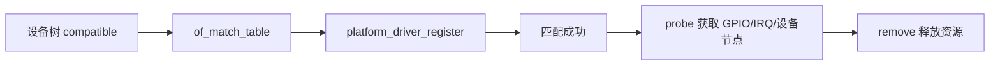

# Linux Platform 驱动

## 概念一句话精炼

Platform 驱动用于把设备树或板级注册的非枚举设备与驱动代码绑定起来，核心生命周期是匹配、`probe` 初始化和 `remove` 释放，并关联 [[Linux GPIO 输入]]。

## 核心原理与图解



> 图 1：设备树 compatible 经 of_match_table 匹配后进入 probe；probe 失败回滚资源，remove 负责撤销非 devm 资源。

匹配表决定驱动是否接管设备；`probe` 失败时必须回滚已获取资源，`remove` 则应释放所有非 devm 资源并注销用户态接口。

## probe/remove 时序与错误回滚

- probe：匹配设备 → 获取 GPIO/IRQ → 初始化等待队列和字符设备 → 创建用户态节点。
- probe 失败：按已成功获取的资源逆序释放，不能把半初始化状态留给后续调用。
- remove：先阻止新的用户访问，再注销设备节点和字符设备，最后释放 IRQ、GPIO 等非 devm 资源。
- compatible、驱动名和设备节点路径存在版本/实现差异，raw 未给出唯一可编译组合。

## 关键实现与数据结构

```c
static const struct of_device_id sr501_of_match[] = {
    { .compatible = "100ask,sr501" }, { }
};
static struct platform_driver sr501_driver = {
    .probe = sr501_probe, .remove = sr501_remove,
    .driver = { .name = "sr501", .of_match_table = sr501_of_match },
};
module_platform_driver(sr501_driver);
```

## 横向对比与关联

- Platform 驱动依赖设备树/板级描述；USB、PCI 等总线驱动则由各自总线枚举设备。
- `probe` 是资源获取和初始化入口；`remove` 是资源释放和状态撤销出口。
- 原始代码存在驱动名、`compatible` 字符串和设备节点创建路径的版本/实现差异，不能直接视为最终可编译驱动。

- [[Linux SR501 驱动]]
- [[Linux 字符设备驱动]]
- [[SR501 Linux 驱动 API 速查]]
- [[Linux HS0038 红外驱动]]
- [[Linux input 子系统]]

## 来源

- raw 文件：`Linux驱动SR501代码.md`
