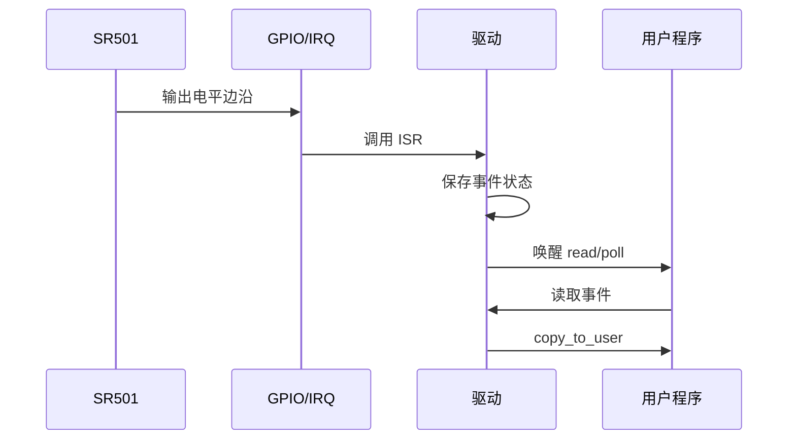

# Linux SR501 驱动

## 概念一句话精炼

SR501 驱动把人体红外传感器的 GPIO 电平变化转换为 Linux 字符设备事件，典型链路为 [[Linux GPIO 中断]] + [[Linux 等待队列]] + 用户态 `read/poll`。

## 核心原理与图解



> 图 1：SR501 输出边沿经 GPIO/IRQ 进入驱动，驱动保存事件并唤醒阻塞的 read/poll，最后在进程上下文完成用户空间拷贝。

原始素材包含多个递进版本：早期代码只有 `probe/remove` 框架，后续版本加入 GPIO、IRQ、等待队列、字符设备和 `device_create`。因此本页总结的是设计链路，不把 raw 中任一片段视作可直接部署的最终实现。

## 驱动流水线与硬件边界

- 初始化：获取输入 GPIO → 转换 IRQ → 注册 ISR/线程化中断 → 初始化字符设备与设备节点 → 对外提供 read/poll。
- 采集：SR501 电平边沿 → IRQ 控制器 → ISR 记录事件 → 设置就绪条件 → 唤醒等待队列 → read/poll 返回 → copy_to_user。
- 退出：先阻止新的用户访问，再注销设备节点和字符设备，最后释放 IRQ、GPIO 等非 devm 资源。
- SR501 本身通过 GPIO 输出状态，raw 没有可由该驱动直接访问的内部寄存器；不要凭空制作寄存器映射表。

~~~c
/* 伪代码：以下函数名表示工程流水线，不是 Linux 官方 API */
probe: gpio = devm_gpiod_get(...); irq = gpiod_to_irq(gpio);
request_irq(irq, sr501_isr, flags, "sr501", dev);
isr: WRITE_ONCE(dev->data, 1); wake_up_interruptible(&dev->wq);
read: ret = wait_event_interruptible(dev->wq, READ_ONCE(dev->data));
if (ret) return ret; copy_to_user(buf, &dev->data, sizeof(dev->data));
~~~
## 关键实现与数据结构

```c
struct sr501 {
    struct gpio_desc *gpio;
    int irq;
    int data;
    wait_queue_head_t wq;
    struct cdev cdev;
};

/* ISR 只记录事件并唤醒；read 再完成用户空间拷贝 */
```

推荐的初始化顺序是：获取输入 GPIO → 转换 IRQ → 注册中断 → 初始化字符设备/设备节点 → 对外提供读取接口。退出顺序应反向执行。

## 原始代码问题与待确认项

- `IRQ_WAKE_THREAD` 需要配套线程化中断处理函数；raw 未给出完整实现。
- `sr501_data` 作为共享状态时需要考虑并发和重复事件，不能只依靠普通整型读写推断完整同步性。
- `copy_to_user` 的返回值必须检查，不能忽略未拷贝字节数。
- `remove` 中应释放 IRQ、GPIO、等待队列关联资源、字符设备和设备节点。
- `device_create`、主设备号、class 和 `file_operations` 的组合需要与目标内核版本 API 对齐。

## 横向对比与关联

- [[Linux GPIO 输入]]：只负责取得输入电平。
- [[Linux GPIO 中断]]：负责把边沿变成事件。
- [[Linux 等待队列]]：负责让读进程睡眠和唤醒。
- [[Linux 字符设备驱动]]：负责建立用户态访问入口。
- [[Linux Platform 驱动]]：负责设备匹配和生命周期。
- [[Linux HS0038 红外驱动]]：对比需要协议脉宽解码并接入 input 子系统的红外接收驱动。

## 来源

- raw 文件：`Linux驱动SR501代码.md`
