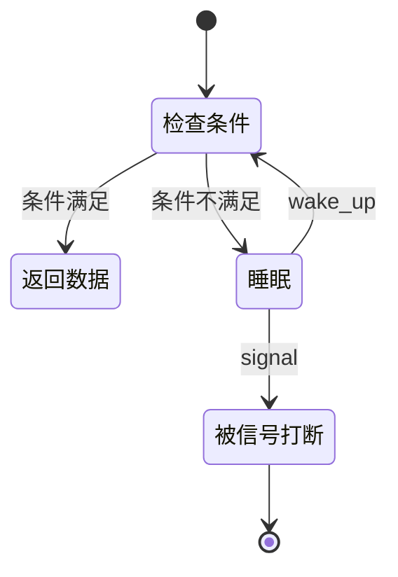

# Linux 等待队列

## 概念一句话精炼

等待队列让内核线程或用户触发的读操作在条件不满足时睡眠，并由 [[Linux GPIO 中断]]在事件到来后唤醒，从而避免忙轮询。

## 核心原理与图解



等待队列的核心是“条件 + 睡眠 + 唤醒”，而不是单独调用 `wait_event_interruptible`。唤醒后必须重新检查条件，因为可能存在多个等待者或事件已被其他线程消费。

## 关键实现与数据结构

```c
wait_queue_head_t wq;
int data_ready;

init_waitqueue_head(&wq);
wait_event_interruptible(wq, data_ready != 0);
if (copy_to_user(buf, &data_ready, sizeof(data_ready))) return -EFAULT;
data_ready = 0;
```

生产代码还应处理信号返回值、并发访问和“先设置条件再唤醒”的顺序；共享状态可使用锁、原子变量或更合适的事件计数结构。

## 横向对比与关联

- **等待队列**：适合让任务睡眠并等待条件。
- **轮询**：实现直观，但会持续消耗 CPU。
- **completion**：适合一次性完成事件；等待队列更适合可重复状态/事件。
- **阻塞 read**：常用等待队列实现；`poll` 则把同一等待队列暴露给事件循环。

- [[Linux SR501 驱动]]
- [[Linux GPIO 中断]]
- [[Linux 字符设备驱动]]

## 来源

- raw 文件：`Linux驱动SR501代码.md`