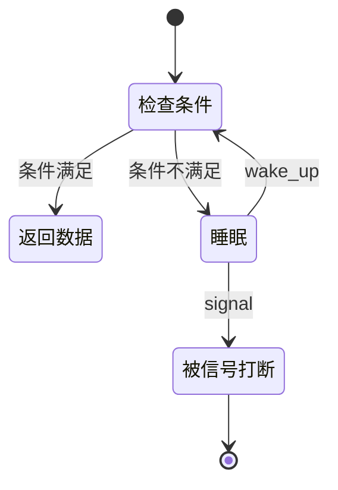

# Linux 等待队列

## 概念一句话精炼

等待队列让内核线程或用户触发的读操作在条件不满足时睡眠，并由 [[Linux GPIO 中断]]在事件到来后唤醒，从而避免忙轮询。

## 核心原理与图解



> 图 1：读路径先检查条件；条件不满足时进入睡眠，生产者设置条件并唤醒，唤醒后重新检查，信号则返回中断错误。

等待队列的核心是“条件 + 睡眠 + 唤醒”，而不是单独调用 `wait_event_interruptible`。唤醒后必须重新检查条件，因为可能存在多个等待者或事件已被其他线程消费。

## 关键实现与数据结构

```c
int ret, ready;
ret = wait_event_interruptible(dev->wq, READ_ONCE(dev->data_ready));
if (ret) return ret;                 /* 信号打断 */
spin_lock_irq(&dev->lock);
ready = dev->data_ready; dev->data_ready = 0;
spin_unlock_irq(&dev->lock);
if (copy_to_user(buf, &ready, sizeof(ready))) return -EFAULT;
```

生产者必须在同一把锁保护下先写入 data_ready，再调用 wake_up_interruptible；多消费者场景应使用事件计数或其他明确的消费协议。copy_to_user 只能在进程上下文执行。

## 横向对比与关联

- **等待队列**：适合让任务睡眠并等待条件。
- **轮询**：实现直观，但会持续消耗 CPU。
- **completion**：适合一次性完成事件；等待队列更适合可重复状态/事件。
- **阻塞 read**：常用等待队列实现；`poll` 则把同一等待队列暴露给事件循环。

- [[Linux SR501 驱动]]
- [[Linux 字符设备驱动]]

## 来源

- raw 文件：`Linux驱动SR501代码.md`