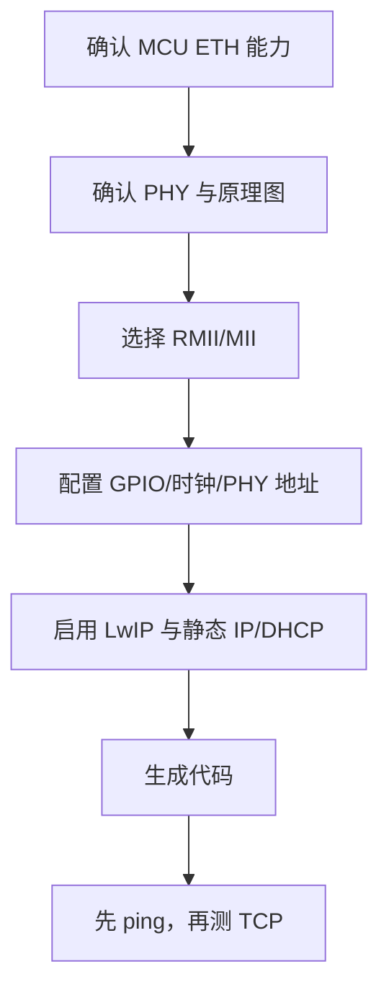

# STM32 CubeMX 配置 LwIP

## 概念一句话精炼

CubeMX 配置 LwIP 的核心是让 STM32 ETH、外部 PHY、网络参数和协议栈选项形成一致链路，配置结果最终由 [[LwIP]] 和 [[STM32 ETH 外设]]共同执行。

## 核心原理与图解



> 图 1：CubeMX 生成的 ETH/LwIP 初始化顺序，以及从链路检查到协议栈启动的验证路径。


原素材以 STM32F407、LAN8720 和 CubeMX 6.4 为例，并提醒 CubeMX 6.5 存在配置差异。该流程只能作为原理和检查顺序，不能当作跨版本固定操作手册。

## 关键实现与配置

```c
/* 生成代码后的最小验证顺序 */
MX_GPIO_Init();
MX_ETH_Init();
MX_LWIP_Init();
while (1) {
    ethernetif_input(&gnetif);
    sys_check_timeouts();
}
```

配置重点：ETH 接口模式与硬件一致；PHY Address 与 [[PHY 地址]]一致；RMII 参考时钟、复位 GPIO 和引脚复用与原理图一致；静态 IP、掩码、网关与 PC 测试网段一致。

## 横向对比与关联

- **静态 IP**：适合实验环境和可控测试，参数需要手动匹配。
- **DHCP**：适合接入现有网络，但增加租约和服务依赖。
- **先 ping 后 TCP**：先验证 ICMP/ARP 与链路，再定位应用回调问题。
- [[RMII 接口]]、[[PHY 地址]]和 [[MAC 层与 PHY 层]]是配置前的硬件前提。

## 原始素材中的待确认项

- CubeMX 版本、PHY 驱动模板和生成代码可能变化。
- LAN8720 借用 LAN8742 配置项时，芯片差异寄存器必须以数据手册为准。
- 原文建议测试时关闭防火墙；该做法只应作为临时排查手段，不应作为长期网络配置。

## 来源

- raw 文件：`【LWIP】stm32用CubeMX配置LwIPplusPingplusTCPcl.md`
