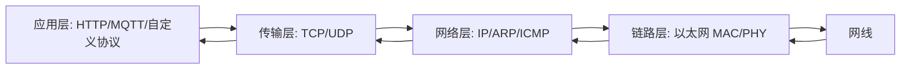

# TCP IP 协议栈

## 概念一句话精炼

TCP/IP 是一组按层协作的网络协议，发送时逐层封装、接收时逐层解封装，[[LwIP]]负责在嵌入式设备中实现其中的协议流程。

## 核心原理与图解




> 图 1?????????????????????????????????
- 链路层负责帧和相邻节点传输。
- 网络层负责 IP 寻址、路由和 ICMP/ARP 协作。
- 传输层提供 TCP 的可靠字节流或 UDP 的无连接数据报。
- 应用层定义业务消息格式。

## 关键实现与数据结构

```c
/* 发送路径的抽象伪代码 */
app_msg = encode_application_message();
tcp_segment = tcp_add_header(app_msg);
ip_packet = ip_route_and_wrap(tcp_segment);
eth_frame = ethernet_wrap(ip_packet);
mac_dma_send(eth_frame);
```

实际工程中，应用通常只调用 [[LwIP RAW API TCP 速查]]，由协议栈完成封装、校验、重传和链路适配。

## 横向对比与关联

- **TCP**：可靠、有序、面向连接，适合控制和数据流。
- **UDP**：无连接、开销低，可靠性由应用自行设计。
- **五层模型**：便于学习和定位问题；不要把“协议层”误认为“某个单一软件模块”。
- [[TCP 连接建立与释放]]聚焦 TCP 状态过程；[[MAC 层与 PHY 层]]聚焦最底层硬件边界。

## 来源

- raw 文件：`【LWIP】初学STM32plusLWIPplus网络遇到的基础问题记录-stm3.md`