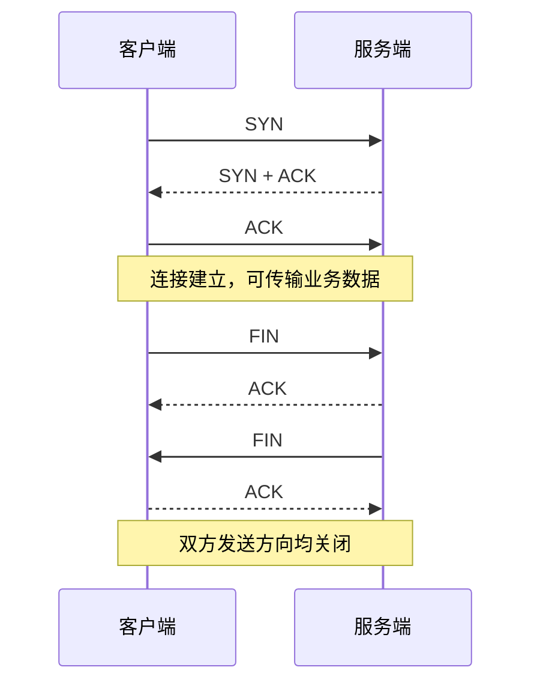

# TCP 连接建立与释放

## 概念一句话精炼

TCP 通过三次握手建立双向通信能力，通过双方分别关闭发送方向完成四次挥手；具体报文由 [[LwIP]]或其他 TCP/IP 协议栈管理。

## 核心原理与图解



握手的重点是确认双方的序列空间和收发能力；挥手分开确认“我不再发送”和“我已经处理完剩余数据”两个方向。TIME_WAIT、重传和异常断开等细节由协议栈状态机处理。

## 关键实现与状态机

```c
/* RAW API 客户端的抽象流程 */
pcb = tcp_new();
tcp_err(pcb, on_error);
err = tcp_connect(pcb, &server_ip, port, on_connected);
if (err != ERR_OK) tcp_close(pcb);
/* on_connected 中注册 recv/sent/err 回调并发送数据 */
```

服务端则是 `tcp_new` → `tcp_bind` → `tcp_listen` → `tcp_accept`。连接关闭时要区分正常 FIN、回调收到 `p == NULL` 和异常 `tcp_abort` 等路径。

## 横向对比与关联

- **三次握手**：建立连接，不等于应用数据已经完整交换。
- **四次挥手**：两个方向分别关闭，不能简单理解为“一次关闭报文”。
- **TCP 与 UDP**：TCP 有连接状态和重传机制；UDP 不执行握手挥手。
- [[TCP IP 协议栈]]解释分层；[[LwIP RAW API TCP 速查]]解释回调 API。

## 原始素材中的待确认项

原文把“握手尝试 5 次”和“发完后停留 2 毫秒”等描述作为通俗说明；这些不是所有系统、版本和网络场景都通用的 TCP 固定常数，实际行为应以协议栈参数和抓包结果为准。

## 来源

- raw 文件：`【LWIP】初学STM32plusLWIPplus网络遇到的基础问题记录-stm3.md`
- raw 文件：`【LWIP】stm32用CubeMX配置LwIPplusPingplusTCPcl.md`