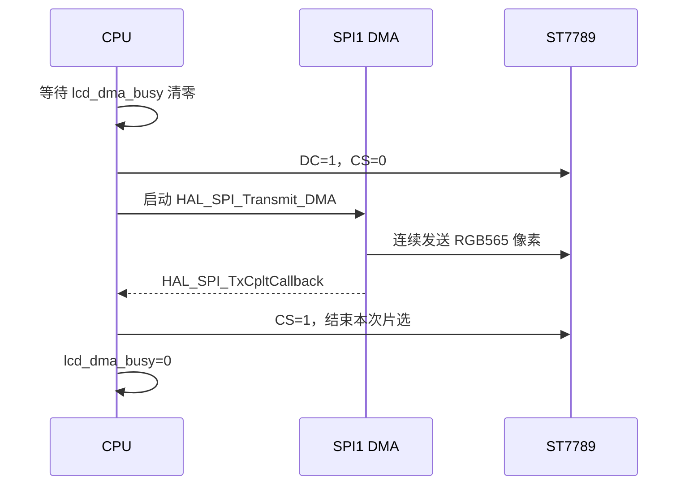

# ST7789 DMA 刷屏

## 概念一句话精炼

ST7789 DMA 刷屏把连续像素搬运交给 SPI DMA，并用忙碌标志和传输完成回调保护 CS、数据缓冲区与下一次传输的边界；关联 [[ST7789 窗口机制]] 与 [[STM32 HAL SPI-GPIO API 速查]]。

## 核心原理与图解



> 图 1：DMA 传输期间 CPU 不应复用或覆盖发送缓冲区；只有完成回调到达后，CS 才能拉高并允许下一次传输。

### 传输边界

- `HAL_SPI_Transmit_DMA` 是异步启动接口，函数返回不代表 SPI 已经把数据发送完。
- `CS` 在 DMA 完成回调中拉高，保证整个像素流处于同一个片选周期。
- 本工程按 60000 字节分块，避免 HAL DMA `Size` 的 16 bit 长度上限。
- SPI1 的 LCD DMA 与 SPI2 的触摸阻塞式读取使用不同 SPI 外设，资源上相互独立，但各自的片选和句柄仍必须分别管理。

## 关键实现与数据结构

以下为表达 DMA 生命周期的伪代码；`lcd_dma_busy`、`HAL_SPI_TxCpltCallback` 中的业务分支和 `LCD_*` 宏属于工程实现，官方 HAL API 只包括被明确标注的 HAL 函数。

```c
volatile uint8_t lcd_dma_busy = 0;

while (lcd_dma_busy) { /* 等待上一块发送完成 */ }
lcd_dma_busy = 1;
HAL_GPIO_WritePin(LCD_DC_GPIO_Port, LCD_DC_Pin, GPIO_PIN_SET);
HAL_GPIO_WritePin(LCD_CS_GPIO_Port, LCD_CS_Pin, GPIO_PIN_RESET);
if (HAL_SPI_Transmit_DMA(&hspi1, data, size) != HAL_OK)
    lcd_dma_busy = 0;              // 启动失败必须回滚状态
```

完成回调的关键逻辑如下：

```c
void HAL_SPI_TxCpltCallback(SPI_HandleTypeDef *hspi)
{
    if (hspi->Instance != SPI1) return;
    HAL_GPIO_WritePin(LCD_CS_GPIO_Port, LCD_CS_Pin, GPIO_PIN_SET);
    lcd_dma_busy = 0;
}
```

## 横向对比与关联

| 方式 | CPU 行为 | 适用场景 | 关键风险 |
|---|---|---|---|
| `HAL_SPI_Transmit` 阻塞发送 | CPU 等待传输结束 | 命令、少量参数 | 长数据占用 CPU |
| `HAL_SPI_Transmit_DMA` | CPU 启动后可处理其他任务 | 图片、矩形、整屏像素 | 缓冲区过早复用、CS 提前释放 |
| 中断逐字节搬运 | CPU 参与每次中断 | 小型控制数据 | 中断频繁，吞吐和时序复杂 |

- [[ST7789 窗口机制]]：DMA 只负责传输，窗口仍由 CASET/PASET/RAMWR 建立。
- [[STM32 HAL SPI-GPIO API 速查]]：查询 DMA、阻塞 SPI 和 GPIO 官方 HAL 函数。
- [[XPT2046 EXTI 触摸中断]]：触摸侧采用“中断置标志、主循环读取”，与 LCD DMA 的异步方向不同。
- [[ST7789-XPT2046-知识地图]]：本技术栈的入口索引。

## 来源

- raw 文件：`st7789+XPT2046驱动说明文档.md`