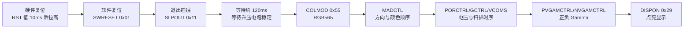

# ST7789 初始化时序

## 概念一句话精炼

ST7789 初始化必须按“硬件复位 → 软件复位 → 退出睡眠 → 像素格式/方向配置 → 时序电压与 Gamma → 开显示”的顺序推进，顺序错误通常表现为黑屏、花屏或颜色异常；关联 [[ST7789 窗口机制]] 与 [[ST7789 DMA 刷屏]]。

## 核心原理与图解



> 图 1：ST7789 从复位状态进入可显示状态的依赖链；`SLPOUT` 后的等待是电荷泵和内部振荡器稳定的关键。

### 关键命令与硬件行为

| 命令/寄存器 | 地址 | 典型配置 | 写入后的硬件行为 |
|---|---:|---|---|
| `SWRESET` | `0x01` | 无参数 | 触发控制器软件复位，使寄存器回到默认状态 |
| `SLPOUT` | `0x11` | 无参数 | 退出睡眠并启动内部振荡器/电荷泵；随后需等待约 120ms |
| `COLMOD` | `0x3A` | `0x55` | 选择 16 bit/pixel，即 RGB565，每像素 2 字节 |
| `MADCTL` | `0x36` | `0xC0` | 本工程反转行、列方向；`0x08` 可用于切换 BGR 顺序 |
| `DISPON` | `0x29` | 无参数 | 在前置配置完成后打开显示输出 |

> raw 中指出：本工程当前 `MADCTL=0xC0` 不包含 `BGR(0x08)`；若红蓝互换，应将颜色顺序作为待验证项单独调整，不要把注释直接当成硬件事实。

## 关键实现与数据结构

以下是表达时序的伪代码，`st7789_cmd`、`st7789_data8` 和 `ST7789_Reset` 是工程封装，不是 STM32 官方 API。

```c
ST7789_Reset();                         // RST 低约 10ms，再拉高
st7789_cmd(ST7789_SWRESET);             // 0x01：软件复位
HAL_Delay(5);                           // 等待内部状态稳定
st7789_cmd(ST7789_SLPOUT);              // 0x11：退出睡眠
HAL_Delay(120);                         // 等待电荷泵稳定
st7789_data8(ST7789_COLMOD, 0x55);      // RGB565
st7789_data8(ST7789_MADCTL, 0xC0);      // 本工程的方向配置
st7789_cmd(ST7789_DISPON);              // 0x29：开显示
```

### 配置边界

- `PORCTRL(0xB2)`、`GCTRL(0xB7)`、`VCOMS(0xBB)`、`LCMCTRL(0xC0)`、`VDVVRHEN(0xC2)`、`VRHS(0xC3)`、`VDVS(0xC4)`、`FRCTRL2(0xC6)` 和 `PWCTRL1(0xD0)` 属于面板相关的时序/电压配置，应以屏厂或控制器推荐值为基线。
- `VDVVRHEN(0xC2)` 必须先写入使能值，随后 `VRHS(0xC3)` 与 `VDVS(0xC4)` 的配置才会生效。
- `PVGAMCTRL(0xE0)` 与 `NVGAMCTRL(0xE1)` 分别控制正、负极性帧的 Gamma 曲线，不能用来替代像素格式或方向配置。

## 横向对比与关联

| 阶段 | 解决的问题 | 典型错误表现 |
|---|---|---|
| 复位/唤醒 | 让控制器脱离未知或睡眠状态 | 黑屏、后续寄存器写入无效 |
| 像素/方向 | 统一主机发送格式和屏幕坐标方向 | 花屏、镜像、红蓝互换 |
| 时序/电压/Gamma | 让面板稳定扫描并改善亮度过渡 | 闪烁、亮度不均、颜色异常 |
| 开显示 | 输出最终配置后的画面 | 半初始化时点亮导致异常 |

- [[ST7789 窗口机制]]：初始化完成后，所有绘图都依赖列/行地址窗口。
- [[ST7789 DMA 刷屏]]：大块像素数据应在窗口建立后通过 DMA 发送。
- [[STM32 SPI 双总线显示触摸架构]]：说明 LCD 与触摸控制器如何使用独立 SPI 资源。
- [[ST7789-XPT2046-知识地图]]：本技术栈的入口索引。

## 来源

- raw 文件：`st7789+XPT2046驱动说明文档.md`