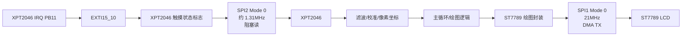

# STM32 SPI 双总线显示触摸架构

## 概念一句话精炼

本工程用 SPI1 + DMA 驱动 ST7789 显示，用独立 SPI2 + 阻塞式事务读取 XPT2046 触摸，使大块刷屏与低频触摸采样在外设资源上隔离；关联 [[ST7789 DMA 刷屏]] 与 [[XPT2046 EXTI 触摸中断]]。

## 核心原理与图解



> 图 1：显示和触摸使用两个独立 SPI 外设；显示侧适合 DMA 连续发送，触摸侧由事件触发后在主循环完成小批量读取。

### 资源配置摘要

| 资源 | 配置 | 硬件用途 |
|---|---|---|
| SPI1 | 主机、8 bit、Mode 0、APB2 `/4`，约 21MHz | ST7789 LCD；TX DMA 为 DMA2 Stream3 Channel3 |
| SPI2 | 主机、8 bit、Mode 0、APB1 `/32`，约 1.3125MHz | XPT2046；不使用 DMA |
| LCD 控制线 | PB0/PB1/PB2 | CS、RST、DC，均由 GPIO 控制 |
| 触摸控制线 | PB10/PB11 | CS 与低有效 IRQ/EXTI |
| 系统时钟 | HSE 8MHz，经 PLL 得到 168MHz | 为 APB1/APB2 和 SPI 分频提供时钟 |

> raw 明确要求 XPT2046 SPI 时钟不超过 2MHz；这里的 SPI2 `/32` 配置满足该约束，不能直接改成 `/16`。

## 关键实现与数据结构

```c
HAL_Init();
SystemClock_Config();
MX_GPIO_Init(); MX_DMA_Init();
MX_SPI1_Init(); MX_SPI2_Init();
ST7789_Init();                         // 工程函数：显示控制器初始化
XT2046_Init();                          // 工程函数：触摸初始化
while (1) {
    XT2046_Update();                    // 事件状态维护
}
```

- CubeMX 生成的 `MX_SPI1_Init`、`MX_SPI2_Init` 属于工程初始化封装，不应写入官方 API 手册。
- `HAL_Init`、`HAL_GPIO_WritePin`、`HAL_SPI_Transmit_DMA` 等 HAL 函数属于官方 API，统一放在 [[STM32 HAL SPI-GPIO API 速查]]。
- `ST7789_Init`、`ST7789_SetWindow`、`XT2046_Init`、`XT2046_GetPoint` 等是本工程自定义驱动接口。

## 横向对比与关联

| 维度 | SPI1 + LCD | SPI2 + 触摸 |
|---|---|---|
| 数据特征 | 大块连续像素流 | 低频、小批量 ADC 读取 |
| 传输方式 | DMA 异步发送 | 主循环阻塞式收发 |
| 片选控制 | LCD CS + DC/RST | TOUCH CS + IRQ |
| 主要同步点 | DMA busy 与完成回调 | EXTI 标志与抬起轮询 |
| 主要红线 | DMA 缓冲区不得提前复用 | SPI 时钟不得超过 2MHz |

- [[ST7789 初始化时序]]：说明显示控制器从复位到可显示状态的顺序。
- [[ST7789 窗口机制]]：说明像素流写入 LCD 显存的寻址方式。
- [[XPT2046 触摸采样与坐标校准]]：说明触摸原始 ADC 如何变成像素坐标。
- [[ST7789-XPT2046-知识地图]]：本技术栈的入口索引。

## 来源

- raw 文件：`st7789+XPT2046驱动说明文档.md`