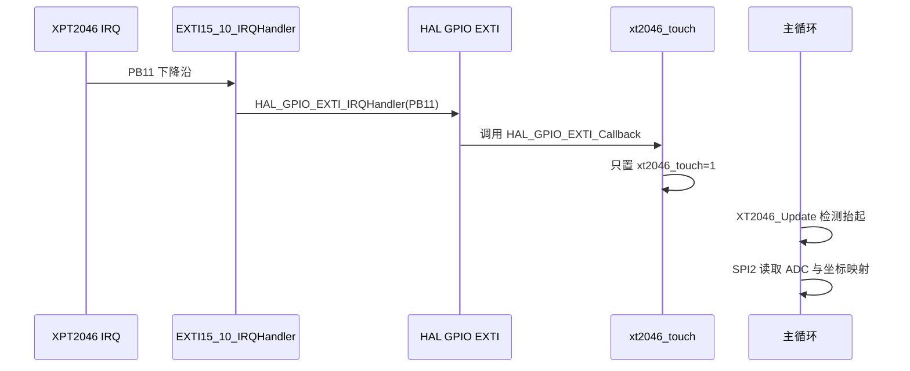

# XPT2046 EXTI 触摸中断

## 概念一句话精炼

XPT2046 的 IRQ 低有效信号通过 STM32 EXTI 进入 HAL 回调，中断上下文只设置触摸标志，SPI 采样和抬起检测放到主循环，从而避免在 ISR 中阻塞；关联 [[XPT2046 触摸采样与坐标校准]] 与 [[STM32 HAL SPI-GPIO API 速查]]。

## 核心原理与图解



> 图 1：中断链只负责把硬件事件转成软件标志；耗时的 SPI 读取、滤波和坐标换算在可控的主循环上下文完成。

### 引脚与 NVIC 配置

- PB11 配置为下降沿 EXTI，保持上拉，使触摸按下时 IRQ 拉低。
- 勾选 `EXTI line[15:10] interrupts`，优先级按工程需要设置；raw 示例给出较低优先级如 2。
- 松开触摸时 IRQ 回高，但当前配置只监听下降沿，因此需要主循环轮询电平清除软件标志。

## 关键实现与数据结构

以下是中断与主循环之间的最小状态机，函数名中的 `HAL_*` 是 HAL 官方接口，`XT2046_Update` 和 `xt2046_touch` 是工程对象。

```c
volatile uint8_t xt2046_touch = 0;

void HAL_GPIO_EXTI_Callback(uint16_t pin)
{
    if (pin == TOUCH_IRQ_Pin)
        xt2046_touch = 1;                // ISR 只置标志
}

while (1)
{
    XT2046_Update();                     // 工程函数：检测抬起
    if (xt2046_touch) XT2046_GetPoint(&x, &y);
}
```

### 并发边界

- `xt2046_touch` 由中断写、主循环读，应使用 `volatile`；如果扩展为多字段状态，则需要临界区或原子保护。
- 中断里不调用阻塞式 `HAL_SPI_TransmitReceive`，不做排序、坐标映射或显示刷新。
- `HAL_GPIO_EXTI_Callback` 是 HAL 提供的弱回调钩子；工程通过强定义重写它，但回调本身不应被误写成“自定义官方 API”。

## 横向对比与关联

| 方案 | 事件响应 | 处理位置 | 适用性 |
|---|---|---|---|
| EXTI 置标志 + 主循环采样 | 触摸按下及时通知 | 主循环完成 SPI 读取 | 当前工程，简单且避免 ISR 阻塞 |
| EXTI 中直接读 SPI | 事件后立即采样 | 中断上下文 | 不推荐，可能阻塞并影响其他中断 |
| 纯轮询 IRQ 电平 | 无中断配置 | 主循环持续检查 | 实现简单，但响应和 CPU 占用受轮询周期影响 |

- [[XPT2046 触摸采样与坐标校准]]：收到标志后执行 24 时钟采样、中值滤波和映射。
- [[STM32 HAL SPI-GPIO API 速查]]：查询 EXTI 处理函数与 GPIO 官方 HAL API。
- [[STM32 SPI 双总线显示触摸架构]]：显示 DMA 和触摸阻塞 SPI 分工不同。
- [[ST7789-XPT2046-知识地图]]：本技术栈的入口索引。

## 来源

- raw 文件：`st7789+XPT2046驱动说明文档.md`